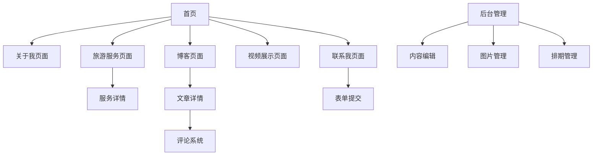

# 多语言个人旅游网站产品需求文档

## 1. 产品概述

一个简洁高效的多语言个人展示网站，专注于成都本地旅游服务推广，支持中英文一键切换。
该网站旨在为游客提供专业的成都旅游导览服务，展示本地文化特色，建立个人品牌影响力。
目标是打造一个集个人展示、服务推广、内容分享于一体的综合性平台，提升旅游服务的专业形象和客户获取能力。

## 2. 核心功能

### 2.1 用户角色

| 角色 | 注册方式 | 核心权限 |
|------|----------|----------|
| 访客用户 | 无需注册 | 浏览所有内容，查看服务套餐，提交联系表单 |
| 管理员 | 后台直接配置 | 内容管理，博客发布，评论管理，排期管理 |

### 2.2 功能模块

我们的多语言个人展示网站包含以下主要页面：
1. **首页**：导航菜单，语言切换，个人简介卡片，特色服务展示，最新博客预览
2. **关于我页面**：个人介绍卡片，成都城市简介，专业技能展示，语言能力说明
3. **旅游服务页面**：服务套餐卡片展示，详细行程说明，预订引导
4. **博客页面**：文章列表，分类筛选，文章详情，评论系统
5. **视频展示页面**：视频分类，嵌入式播放器，响应式布局
6. **联系我页面**：联系表单，微信二维码，社交平台链接
7. **后台管理页面**：内容编辑，图片管理，排期管理

### 2.3 页面详情

| 页面名称 | 模块名称 | 功能描述 |
|----------|----------|----------|
| 首页 | 导航栏 | 多语言切换按钮，页面导航菜单，响应式设计 |
| 首页 | 个人简介区 | 头像展示，简短自我介绍，核心技能标签 |
| 首页 | 服务预览 | 3个主要服务套餐卡片，快速了解按钮 |
| 首页 | 博客预览 | 最新3篇博客文章摘要，查看更多链接 |
| 关于我页面 | 个人信息卡片 | 详细个人介绍，专业背景，服务理念 |
| 关于我页面 | 成都介绍 | 200字城市简介，文化特色，旅游亮点 |
| 关于我页面 | 技能展示 | 摄影技能，美食知识，历史文化专长 |
| 关于我页面 | 语言能力 | 中英文水平说明，沟通优势 |
| 旅游服务页面 | 套餐展示 | 成都经典一日游，美食文化体验，历史文化导览 |
| 旅游服务页面 | 行程详情 | 时间安排，核心体验点，服务包含内容 |
| 旅游服务页面 | 预订引导 | 社交平台联系按钮，咨询方式说明 |
| 博客页面 | 文章列表 | 分页显示，分类筛选，搜索功能 |
| 博客页面 | 文章详情 | 内容展示，社交分享，评论系统 |
| 博客页面 | 分类管理 | 旅行小贴士，文化趣闻，实用指南 |
| 视频展示页面 | 视频播放器 | 嵌入式播放，自适应尺寸，播放控制 |
| 视频展示页面 | 分类浏览 | 按主题分类，缩略图展示，描述信息 |
| 联系我页面 | 联系表单 | 姓名，邮箱，消息内容，提交验证 |
| 联系我页面 | 联系方式 | 微信二维码，社交平台链接，响应时间说明 |
| 后台管理页面 | 内容管理 | 博客文章编辑，页面内容更新，图片上传 |
| 后台管理页面 | 排期管理 | 服务日程安排，可用时间设置，预订状态 |

## 3. 核心流程

**访客用户流程：**
用户访问首页 → 浏览个人介绍和服务预览 → 查看详细服务套餐 → 阅读博客内容 → 观看展示视频 → 通过联系表单或社交平台咨询服务

**管理员流程：**
后台登录 → 内容管理（发布博客，更新页面内容）→ 图片管理（上传和组织媒体文件）→ 排期管理（设置可用时间，管理预订）

## 4. 用户界面设计

### 4.1 设计风格

- **主色调**：现代淡蓝色 (#3B82F6) 和深海蓝 (#1E40AF)，体现专业、清新、现代的品牌形象
- **辅助色**：天空蓝 (#E0F2FE)、浅蓝灰 (#F1F5F9) 和纯白 (#FFFFFF) 作为背景色
- **强调色**：青绿色 (#10B981) 用于成功状态，珊瑚橙 (#F59E0B) 用于警告提示
- **按钮样式**：现代圆角设计 (border-radius: 12px)，微妙阴影，渐变蓝色背景，流畅过渡动画
- **字体**：中文使用苹方/PingFang SC，英文使用 Inter/SF Pro，标题 20-28px，正文 15-17px
- **布局风格**：极简卡片设计，柔和阴影 (0 4px 20px rgba(59, 130, 246, 0.1))，现代网格系统
- **图标风格**：现代线性图标，2px描边，微动画效果，统一的淡蓝色调

### 4.2 页面设计概览

| 页面名称 | 模块名称 | UI元素 |
|----------|----------|--------|
| 首页 | 导航栏 | 毛玻璃效果，淡蓝色背景，现代字体，流畅语言切换动画 |
| 首页 | 个人简介区 | 大尺寸头像，淡蓝渐变背景，现代标签设计，微妙入场动画 |
| 首页 | 服务预览 | 响应式卡片网格，淡蓝色边框，悬停时轻微上浮效果 |
| 关于我页面 | 信息卡片 | 现代分栏布局，淡蓝色分割线，优雅的时间轴设计 |
| 旅游服务页面 | 套餐卡片 | 现代卡片设计，淡蓝色价格标签，简约图标，现代CTA按钮 |
| 博客页面 | 文章列表 | 现代网格布局，淡蓝色标签系统，简洁分页设计 |
| 视频展示页面 | 播放器 | 现代播放器界面，淡蓝色控制条，流畅全屏过渡 |
| 联系我页面 | 表单设计 | 现代输入框设计，淡蓝色焦点状态，优雅验证提示 |

### 4.3 现代视觉层次

- **主要内容区域**：纯白背景，充足留白，突出内容重点
- **次要信息区域**：浅蓝灰背景 (#F1F5F9)，区分层次
- **交互元素**：淡蓝色主题，悬停时加深颜色，微妙的缩放效果
- **文字层次**：深灰色 (#1F2937) 主文本，中灰色 (#6B7280) 次要文本，淡蓝色 (#3B82F6) 链接文本
- **分割元素**：极细的淡蓝色分割线 (#E0F2FE)，营造清爽感

### 4.4 现代交互效果

- **页面加载**：优雅的淡入动画，从上到下依次显示内容
- **卡片悬停**：轻微上浮 (transform: translateY(-4px))，阴影加深
- **按钮交互**：颜色渐变过渡，轻微缩放效果 (transform: scale(1.02))
- **表单焦点**：淡蓝色边框高亮，柔和的发光效果
- **页面切换**：流畅的滑动过渡，保持视觉连贯性

### 4.5 响应式设计

网站采用移动优先的现代响应式设计，确保在所有设备上都有出色的视觉体验。
- **桌面端** (1200px+)：宽松的多列布局，丰富的微交互效果，大尺寸卡片设计
- **平板端** (768px-1199px)：适中的间距，触摸友好的按钮尺寸，优化的导航体验
- **手机端** (320px-767px)：单列布局，大号触摸目标，简化的导航菜单，优化的滚动体验