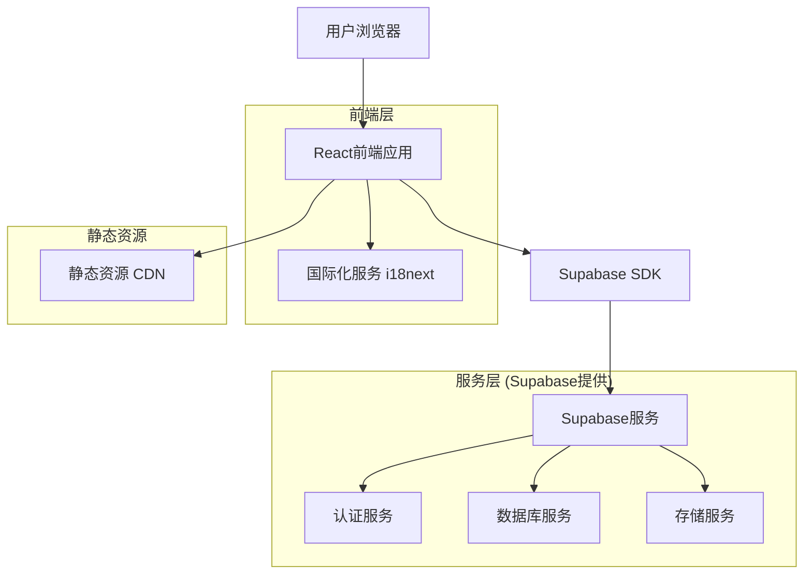
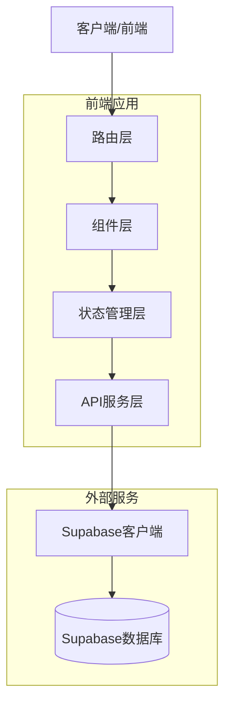
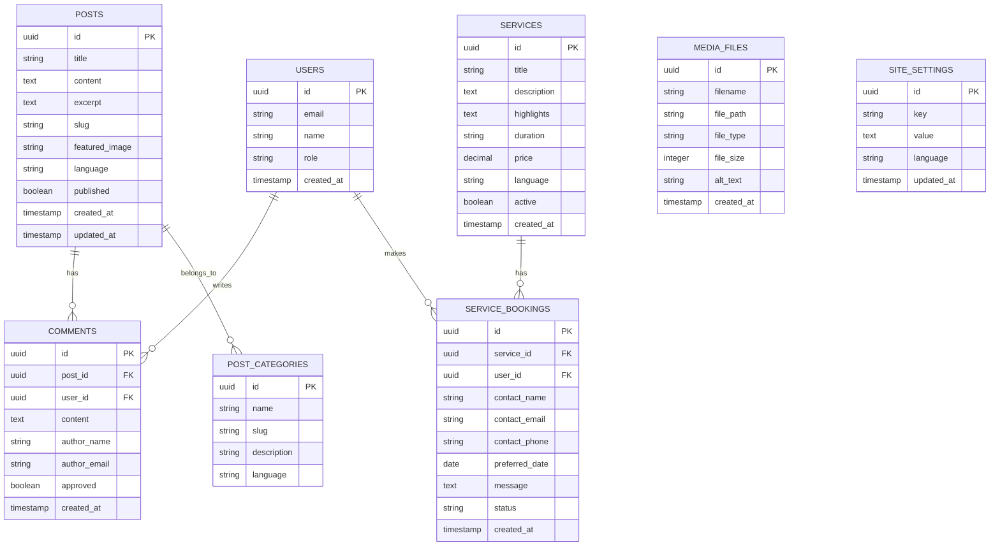

# 多语言个人旅游网站技术架构文档

## 1. 架构设计



## 2. 技术描述

- **前端**: React@18 + TypeScript + Tailwind CSS@3 + Vite + React Router + i18next
- **后端**: Supabase (认证、数据库、存储)
- **部署**: 支持多种平台 (JAMstack架构)

## 3. 路由定义

| 路由 | 用途 |
|------|------|
| / | 首页，展示个人简介、服务预览和最新博客 |
| /about | 关于我页面，详细个人介绍和技能展示 |
| /services | 旅游服务页面，展示所有服务套餐 |
| /services/:id | 服务详情页面，显示具体套餐信息 |
| /blog | 博客列表页面，文章分类和搜索 |
| /blog/:slug | 博客详情页面，文章内容和评论 |
| /videos | 视频展示页面，分类浏览视频内容 |
| /contact | 联系我页面，联系表单和联系方式 |
| /admin | 后台管理入口，需要认证 |
| /admin/posts | 博客文章管理 |
| /admin/media | 图片和媒体文件管理 |
| /admin/schedule | 排期和预订管理 |

## 4. API定义

### 4.1 核心API

**博客文章相关**
```
GET /api/posts
```

请求参数:
| 参数名称 | 参数类型 | 是否必需 | 描述 |
|----------|----------|----------|------|
| page | number | false | 页码，默认为1 |
| limit | number | false | 每页数量，默认为10 |
| category | string | false | 文章分类筛选 |
| lang | string | false | 语言筛选 (zh/en) |

响应:
| 参数名称 | 参数类型 | 描述 |
|----------|----------|------|
| posts | Post[] | 文章列表 |
| total | number | 总数量 |
| hasMore | boolean | 是否有更多 |

**联系表单提交**
```
POST /api/contact
```

请求:
| 参数名称 | 参数类型 | 是否必需 | 描述 |
|----------|----------|----------|------|
| name | string | true | 联系人姓名 |
| email | string | true | 邮箱地址 |
| message | string | true | 留言内容 |
| service | string | false | 感兴趣的服务 |

响应:
| 参数名称 | 参数类型 | 描述 |
|----------|----------|------|
| success | boolean | 提交状态 |
| message | string | 响应消息 |

示例:
```json
{
  "name": "张三",
  "email": "zhangsan@example.com",
  "message": "我对成都一日游很感兴趣，请联系我",
  "service": "chengdu-day-tour"
}
```

## 5. 服务器架构图



## 6. 数据模型

### 6.1 数据模型定义



### 6.2 数据定义语言

**文章表 (posts)**
```sql
-- 创建文章表
CREATE TABLE posts (
    id UUID PRIMARY KEY DEFAULT gen_random_uuid(),
    title VARCHAR(255) NOT NULL,
    content TEXT NOT NULL,
    excerpt TEXT,
    slug VARCHAR(255) UNIQUE NOT NULL,
    featured_image VARCHAR(500),
    language VARCHAR(5) DEFAULT 'zh' CHECK (language IN ('zh', 'en')),
    published BOOLEAN DEFAULT false,
    created_at TIMESTAMP WITH TIME ZONE DEFAULT NOW(),
    updated_at TIMESTAMP WITH TIME ZONE DEFAULT NOW()
);

-- 创建索引
CREATE INDEX idx_posts_language ON posts(language);
CREATE INDEX idx_posts_published ON posts(published);
CREATE INDEX idx_posts_created_at ON posts(created_at DESC);

-- 权限设置
GRANT SELECT ON posts TO anon;
GRANT ALL PRIVILEGES ON posts TO authenticated;
```

**评论表 (comments)**
```sql
-- 创建评论表
CREATE TABLE comments (
    id UUID PRIMARY KEY DEFAULT gen_random_uuid(),
    post_id UUID REFERENCES posts(id) ON DELETE CASCADE,
    user_id UUID REFERENCES auth.users(id) ON DELETE SET NULL,
    content TEXT NOT NULL,
    author_name VARCHAR(100) NOT NULL,
    author_email VARCHAR(255) NOT NULL,
    approved BOOLEAN DEFAULT false,
    created_at TIMESTAMP WITH TIME ZONE DEFAULT NOW()
);

-- 创建索引
CREATE INDEX idx_comments_post_id ON comments(post_id);
CREATE INDEX idx_comments_approved ON comments(approved);

-- 权限设置
GRANT SELECT ON comments TO anon;
GRANT ALL PRIVILEGES ON comments TO authenticated;
```

**服务表 (services)**
```sql
-- 创建服务表
CREATE TABLE services (
    id UUID PRIMARY KEY DEFAULT gen_random_uuid(),
    title VARCHAR(255) NOT NULL,
    description TEXT NOT NULL,
    highlights TEXT[],
    duration VARCHAR(50),
    price DECIMAL(10,2),
    language VARCHAR(5) DEFAULT 'zh' CHECK (language IN ('zh', 'en')),
    active BOOLEAN DEFAULT true,
    created_at TIMESTAMP WITH TIME ZONE DEFAULT NOW()
);

-- 权限设置
GRANT SELECT ON services TO anon;
GRANT ALL PRIVILEGES ON services TO authenticated;

-- 初始数据
INSERT INTO services (title, description, highlights, duration, price, language) VALUES
('成都经典一日游', '深度体验成都文化精髓，探索古老与现代的完美融合', ARRAY['宽窄巷子历史文化', '正宗川菜品鉴', '熊猫基地近距离接触'], '4-6小时', 299.00, 'zh'),
('美食文化体验', '舌尖上的成都之旅，品味地道川菜文化', ARRAY['传统茶馆体验', '街头小吃探索', '川菜烹饪学习'], '2-3小时', 199.00, 'zh'),
('历史文化导览', '穿越千年时光，感受天府之国的深厚底蕴', ARRAY['武侯祠三国文化', '杜甫草堂诗歌文化', '金沙遗址古蜀文明'], '3-4小时', 249.00, 'zh');
```

**联系表单表 (contact_messages)**
```sql
-- 创建联系表单表
CREATE TABLE contact_messages (
    id UUID PRIMARY KEY DEFAULT gen_random_uuid(),
    name VARCHAR(100) NOT NULL,
    email VARCHAR(255) NOT NULL,
    message TEXT NOT NULL,
    service VARCHAR(100),
    status VARCHAR(20) DEFAULT 'new' CHECK (status IN ('new', 'read', 'replied')),
    created_at TIMESTAMP WITH TIME ZONE DEFAULT NOW()
);

-- 权限设置
GRANT INSERT ON contact_messages TO anon;
GRANT ALL PRIVILEGES ON contact_messages TO authenticated;
```

**网站设置表 (site_settings)**
```sql
-- 创建网站设置表
CREATE TABLE site_settings (
    id UUID PRIMARY KEY DEFAULT gen_random_uuid(),
    key VARCHAR(100) NOT NULL,
    value TEXT,
    language VARCHAR(5) DEFAULT 'zh',
    updated_at TIMESTAMP WITH TIME ZONE DEFAULT NOW(),
    UNIQUE(key, language)
);

-- 权限设置
GRANT SELECT ON site_settings TO anon;
GRANT ALL PRIVILEGES ON site_settings TO authenticated;

-- 初始数据
INSERT INTO site_settings (key, value, language) VALUES
('site_title', '成都文化旅游向导', 'zh'),
('site_description', '专业的成都本地文化旅游服务，带您深度体验天府之国的独特魅力', 'zh'),
('about_intro', '我是一名热爱成都文化的专业导游，拥有丰富的本地旅游经验...', 'zh'),
('site_title', 'Chengdu Cultural Tour Guide', 'en'),
('site_description', 'Professional local cultural tourism services in Chengdu', 'en'),
('about_intro', 'I am a professional tour guide who loves Chengdu culture...', 'en');
```